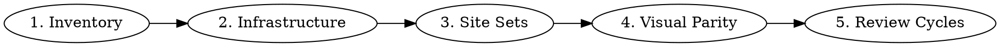

# TYPO3 Project Upgrade

Systematic approach for upgrading deployed TYPO3 project instances across major versions.

> **Scope**: Project-level upgrades (site config, TypoScript, templates, infrastructure, DB).
> For extension code upgrades, use `typo3-extension-upgrade`.

## When to Use

- Upgrading a TYPO3 website from one LTS to another (v11→v12, v12→v13, v13→v14)
- Migrating sys_template records to Site Sets (v13+)
- Upgrading Bootstrap Package across major versions (v12→v14→v16)
- Migrating BS4→BS5 styling
- Comparing old vs new site for visual parity

## Migration Phases



## Phase 1: Inventory

Before touching code, understand what exists:

```bash
# List sys_template records (will be replaced by site sets)
SELECT uid, pid, root, title, include_static_file FROM sys_template;

# List content elements by type
SELECT CType, COUNT(*) FROM tt_content WHERE deleted=0 GROUP BY CType ORDER BY COUNT(*) DESC;

# List extensions
vendor/bin/typo3 extension:list
```

**Document**: Which sys_templates have `root=1`? What TypoScript constants/config do they set? What `include_static_file` references exist?

## Phase 2: Infrastructure (Docker)

### ImageMagick Required

TYPO3 needs ImageMagick for image processing. Without it, ALL images serve unprocessed originals (10-30x larger).

```dockerfile
# Alpine
apk add --no-cache imagemagick

# Debian
apt-get install -y imagemagick
```

GFX configuration in `config/system/settings.php`:
```php
'GFX' => [
    'processor' => 'ImageMagick',
    'processor_path' => '/usr/bin/',
    'processor_effects' => true,
],
```

### After Adding ImageMagick

```sql
-- Clear stale processed file records from v11
TRUNCATE TABLE sys_file_processedfile;
```
```bash
# Clear processed files directory
rm -rf public/fileadmin/_processed_/*
# Flush caches so TYPO3 regenerates
vendor/bin/typo3 cache:flush
```

## Phase 3: sys_template → Site Sets (v13+)

### Site Set Structure

```
packages/my-site/Configuration/Sets/MySite/
├── config.yaml          # Set name, label, dependencies
├── settings.yaml        # Theme settings + SCSS variables
├── setup.typoscript     # TypoScript setup
└── constants.typoscript # TypoScript constants (optional)
```

### config.yaml — Dependencies

```yaml
name: vendor/my-site
label: My Site
dependencies:
  - bootstrap-package/full    # BS Package with all features
  - georgringer/news           # News extension
  - georgringer/news-twb5      # News BS5 templates (provided BY news ext)
```

### Site Configuration — Reference Site Set

In `config/sites/default/config.yaml`:
```yaml
dependencies:
  - vendor/my-site
```

### sys_template Cleanup

**CRITICAL**: Delete ALL sys_template records when using site sets. A surviving `root=1` template with `include_static_file` will override site sets, causing "No page configured for type=0".

```sql
-- Delete ALL — site sets replace them entirely
DELETE FROM sys_template;
```

**Common mistake**: Only checking the `config` column. The `include_static_file` column also references extensions and will conflict with site sets.

### settings.yaml — Map Old Constants

Old TypoScript constants → new site set settings:

| Old Constant | New Setting |
|---|---|
| `page.logo.file` | `page.logo.file: fileadmin/...` |
| `page.theme.navigation.style` | `page.theme.navigation.style: 'default-transition'` |
| `page.theme.navigation.type` | `page.theme.navigation.type: top` |
| `page.theme.breadcrumb.enable` | `page.theme.breadcrumb.enable: true` |
| `page.theme.copyright.enable` | `page.theme.copyright.enable: false` |

### SCSS Variable Injection

BS Package's `ScssParser.php` injects ALL `plugin.bootstrap_package.settings.scss.*` keys as SCSS variables — even ones not in `settings.definitions.yaml`.

```yaml
# Colors
plugin.bootstrap_package.settings.scss.primary: '#585961'
plugin.bootstrap_package.settings.scss.secondary: '#2f99a4'

# Link behavior (replaces CSS !important overrides)
plugin.bootstrap_package.settings.scss.link-decoration: 'none'
plugin.bootstrap_package.settings.scss.link-hover-decoration: 'underline'

# WCAG contrast ratio (BS5 default 4.5 → 3 restores v11 behavior)
plugin.bootstrap_package.settings.scss.min-contrast-ratio: '3'

# Navbar link opacity
plugin.bootstrap_package.settings.scss.navbar-light-color: 'rgba(0,0,0,.55)'

# Footer backgrounds
plugin.bootstrap_package.settings.scss.dark: '#cccdcc'
plugin.bootstrap_package.settings.scss.darker: '#ffffff'
```

**Key insight**: Prefer SCSS variables over CSS overrides. Check BS5's `_variables.scss` for available `!default` variables — any of them can be overridden via the `plugin.bootstrap_package.settings.scss.*` mechanism.

### Per-Page Behavior via TypoScript Conditions

v11 used per-page sys_template records. v14 site sets are global. Use TypoScript conditions for per-page behavior:

```typoscript
# Different navbar on homepage vs inner pages
[traverse(page, "uid") != 1]
    page.headerData.200 = TEXT
    page.headerData.200.value (
        <style>/* inner page overrides */</style>
    )
[END]

# RSS feed page (replaces old sys_template PAGE override)
[traverse(page, "uid") == 99]
    page >
    page = PAGE
    page.config.disableAllHeaderCode = 1
    page.config.additionalHeaders.10.header = Content-Type:application/rss+xml;charset=utf-8
    page.10 = TEXT
    page.10.value (<?xml ... ?>)
[END]
```

## Phase 4: Bootstrap Package v12→v16 / BS4→BS5

### CSS Custom Properties for Frames

BS Package v16 uses `color-contrast()` to compute text colors for colored frames. With `min-contrast-ratio: 4.5` (BS5 default), `color-contrast(#2f99a4)` returns black. Setting `min-contrast-ratio: 3` returns white (matching v11).

**Cards inside colored frames** inherit white text (invisible on white card bg). Fix:
```css
.frame-background-secondary .card {
    --frame-color: var(--bs-body-color);
    --frame-header-color: var(--bs-body-color);
    --frame-link-color: var(--bs-link-color);
    --frame-link-hover-color: var(--bs-link-hover-color);
}
```

### Navigation Changes

| v11 (BS Package v12) | v14 (BS Package v16) |
|---|---|
| `<a class="nav-link dropdown-toggle">` | Split: `<a class="nav-link-main">` + `<button class="nav-link-toggle">` |
| `dropdown-hover` class for hover-open | Removed — click-only by default |
| `navbar-default` per page via sys_template | `navbar-default-transition` global via site set |
| `position: fixed` | `position: sticky` |

**Restore hover dropdowns** (scoped to items with children):
```css
@media (min-width: 992px) {
    .navbar-mainnavigation .nav-item.nav-style-simple:hover > .dropdown-menu,
    .navbar-mainnavigation .nav-item.nav-style-mega:hover > .dropdown-menu {
        display: block;
        top: 100%;
        left: 0;
        margin-top: 0;
    }
}
```

### Sticky Header Scroll Flicker

**Known bug**: [benjaminkott/bootstrap_package#1468](https://github.com/benjaminkott/bootstrap_package/issues/1468)

BS Package v16 changed `.navbar-fixed-top` from `position: fixed` to `position: sticky`. When `navbar-transition` shrinks the navbar (110→70px), document height changes, causing `scrollY` to oscillate around the threshold.

**Root cause fix** — compensate with margin-bottom to keep document height constant:
```css
@media (min-width: 992px) {
    .navbar-mainnavigation.navbar-transition {
        margin-bottom: 30px; /* 100px default - 70px transition */
    }
}
@media (min-width: 1200px) {
    .navbar-mainnavigation.navbar-transition {
        margin-bottom: 40px; /* 110px default - 70px transition */
    }
}
```

For SCSS (upstream fix in `_transition.scss`):
```scss
.navbar-transition {
    @each $breakpoint in map-keys($navbar-heights) {
        $default-height: map-get($navbar-heights, $breakpoint);
        $transition-height: map-get($navbar-heights, xs);
        @if $default-height != $transition-height {
            @include media-breakpoint-up($breakpoint) {
                margin-bottom: $default-height - $transition-height;
            }
        }
    }
}
```

### BS5 Changes to Accept (Not Fight)

| Change | Reason |
|---|---|
| Split link/button for dropdown nav | Accessibility |
| 3-level nav depth (mega-menu) | BS Package v16 design |
| `frame-height-default` class on frames | New structural class |
| `data-bs-*` attributes (BS4 `data-*` removed) | Bootstrap 5 standard |
| Twitter → X icon rename | Brand update |
| Individual JS/CSS files (not merged) | TYPO3 v14 asset pipeline |
| 3 skip links instead of 1 | Accessibility |
| Page titles include site name suffix | TYPO3 v14 site config |

## Phase 5: Review Methodology

### Structural Comparison (curl)

```bash
# Compare HTTP status across all pages
for page in / /content-examples/ /blog/ /pages/default/ /contact/; do
  old=$(curl -sL -o /dev/null -w "%{http_code}" "https://old-site$page")
  new=$(curl -sL -o /dev/null -w "%{http_code}" "https://new-site$page")
  echo "$page: old=$old new=$new"
done

# Compare content element IDs
curl -sL "https://site/page/" | grep -oP 'id="c\d+"' | sort

# Compare frame classes
curl -sL "https://site/page/" | grep -oP 'class="frame [^"]*"' | sort

# Check image processing
curl -sL "https://site/" | grep -c "_processed_"
```

### Categorize Differences

| Category | Action |
|---|---|
| **MIGRATION GAP** | Missing config/setting — fix it |
| **BS5 CHANGE** | Intentional framework change — accept it |
| **CSS OVERRIDE NEEDED** | No config equivalent exists — document why |

### Database Fixes

```sql
-- Enable carousel autoplay (BS Package v16 defaults to off)
UPDATE tt_content SET pi_flexform = REPLACE(pi_flexform,
  '<field index="interval">',
  '<field index="autoplay"><value index="vDEF">1</value></field><field index="interval">')
WHERE uid = <CAROUSEL_UID> AND CType = 'carousel';

-- Fix form definition path (EXT:introduction removed)
UPDATE tt_content SET pi_flexform = REPLACE(pi_flexform,
  'EXT:introduction/Resources/Private/Forms/...',
  'EXT:bootstrap_package/Resources/Private/Forms/Contact.form.yaml')
WHERE uid = <FORM_UID>;
```

## Common Mistakes

| Mistake | Fix |
|---|---|
| CSS hacks instead of SCSS variables | Check if a `$variable` exists in BS5's `_variables.scss` — override via `plugin.bootstrap_package.settings.scss.*` |
| Deleting sys_template only by `config` column | Check ALL columns (`include_static_file`, `constants`, `config`) or just `DELETE FROM sys_template` |
| Missing ImageMagick in Docker | All images serve unprocessed originals (10-30x file size) |
| Fighting BS5 accessibility changes | Split link/button nav, skip links, semantic HTML — accept these |
| `page.theme.breadcrumb.enable: false` when old site had breadcrumbs | Always verify against old site, don't assume |
| Using `position: fixed` to fix scroll flicker | Use margin-bottom compensation instead — keeps `position: sticky` behavior |
| Overwriting PRs/commits instead of creating alternatives | Keep working artifacts intact, create new branches/PRs for alternative approaches |
